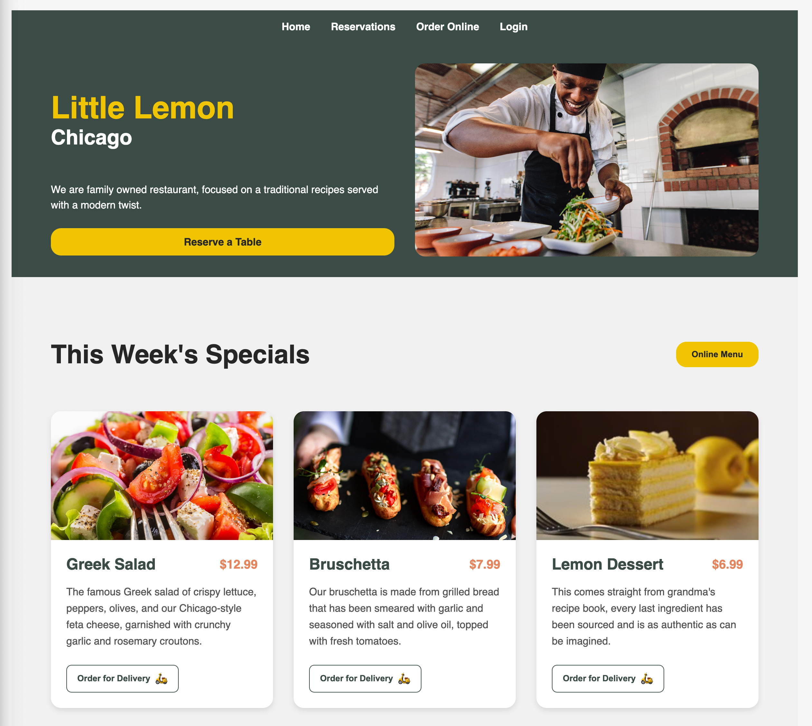

# Little Lemon Restaurant - React Application



## Overview

Little Lemon is a modern React-based website for a Mediterranean restaurant in Chicago. This application features a responsive design with multiple sections including a hero banner, specials menu, testimonials, about section, and reservation capabilities.

## Features

- **Responsive Design**: Works on all device sizes
- **Modern UI Components**:
  - Interactive hero section with call-to-action
  - Featured specials with hover effects
  - Customer testimonials with star ratings
  - About section with founder bios
- **Navigation**: Smooth routing between pages
- **Accessibility**: Semantic HTML and ARIA labels

## Technologies Used

- React 18
- React Router DOM
- Vite (Build Tool)
- CSS Modules
- React Icons
- Responsive Grid/Flexbox layouts

## Installation

1. Clone the repository:

   ```bash
   git clone https://github.com/nomad-alt/little-lemon-app.git
   ```

2. Install dependencies:

   ```bash
   cd little-lemon
   npm install
   ```

3. Run the development server:

   ```bash
   npm run dev
   ```

4. Open your browser to:
   ```
   http://localhost:3000
   ```

## Project Structure

```
src/
├── assets/              # Images and static files
├── components/          # Reusable components
│   ├── About.jsx        # About section
│   ├── Footer.jsx       # Site footer
│   ├── Hero.jsx         # Hero banner
│   ├── Nav.jsx          # Navigation bar
│   ├── Specials.jsx     # Menu specials
│   └── Testimonials.jsx # Customer reviews
├── App.jsx              # Main application
├── main.jsx             # Entry point
└── App.css              # App styles
```

## Available Scripts

- `npm run dev`: Starts development server
- `npm run build`: Creates production build
- `npm run preview`: Previews production build locally
- `npm run lint`: Runs ESLint

## Customization

To customize this project:

1. Update images in `src/assets/`
2. Modify content in component files
3. Adjust colors in `app.css`
4. Update restaurant information in the Footer component

## License

This project is licensed under the MIT License.

## Credits

Design inspired by Meta Front-End Developer Program coursework.
